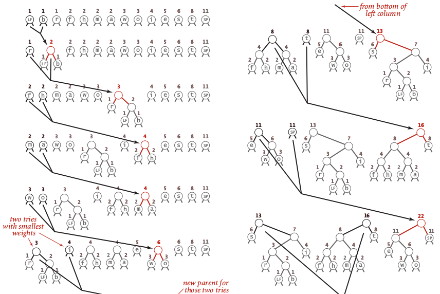
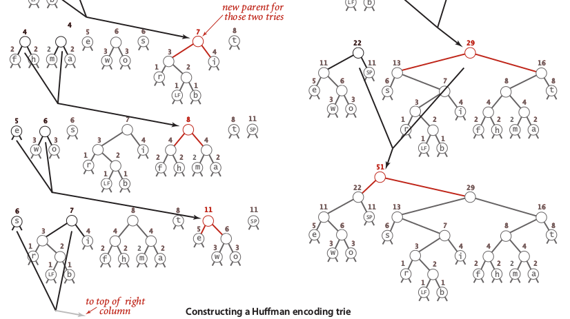
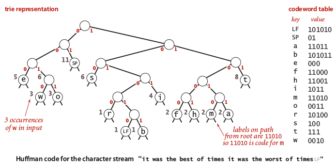

## Huffman compression {#huffman-compression}

This is widely used compressing technique that used frequency information to save space. The idea is we can used fewer bits \(less than 8 bits\) to represent high frequency ASCII character. Huffman compression will produce _prefix-free code_ that can be uniquely decodable, so we can avoid miss-interpretation. Huffman compression encode all codewords by constructing **trie**, also known as huffman encoding. But, rather than construct a trie from root to bottom, we construct it from bottom to root. We keep the characters to be encoded in leaves and maintain the frequency instance variable in each node that represent the frequency of all character in the subtree rooted at that node. Below step by step how to construct huffman code using trie:

1. Create a forest of 1-nodes trees \(leaves\) ordered by its frequency.

2. Find the two nodes with the smallest frequency, then create a new node which is a parent of thos two nodes which has frequency equal to sum of child nodes.

3. Repeat step 2 until all node construct a tree.

An image below illustrate how to construct a huffman code of word “it was the best of times it was the worst of times”.





To represent binary, we can insert each 0 on the left side and 1 on the right side. A complete codeword table of Huffman encoding illustrate in an image below:



Codeword table produced by Huffman encoding is **optimal** because it is equal to product of frequency times word length.

Huffman encoding is **two-pass algorithm ** because read input stream twice while encode and compress.

Now to do compression, we need following steps:

1. Read the input.

2. Tabulate the frequency of occurrence of each value in the input.

3. Build the Huffman encoding trie corresponding to those frequencies.

4. Build the corresponding codeword table, to associate a bitstring with each char value in the input.

5. Write the trie, encoded as a bitstring.

6. Write a count of character in the input, encoded as a bitstring.

7. Use the codeword table to write the codeword for each input character.

Then to do decompression or expand, we need following steps:

1. Read the trie.

2. Read the count if character to be decoded.

3. Use the trie to decode the bitstream.

Below a full implementation of Huffman encoding, compression and decompression in java:

```
public class Huffman
{
    private static final int R = 256;

    private Huffman() {}

    private static class Node implements Comparable<Node> {
        private final char ch;
        private final int freq;
        private final Node left, right;

        Node(char ch, int freq, Node left, Node right) {
            this.ch = ch;
            this.freq = freq;
            this.left = left;
            this.right = right;
        }

        private boolean isLeaf() {
            assert ((left == null) && (right == null)) || ((left != null) && (right != null));
            return (left == null) && (right == null);
        }

        public int compareTo(Node that) {
            return this.freq – that.freq;
        }

        public static void compress() {
            String s = BinaryStdIn.readString();
            char[] input = s.toCharArray();

            int[] freq = new int[R];
            for (int i = 0; i < input.length; i++)
                freq[input[i]]++;

            Node root = buildTrie(freq);

            String[] st = new String[R];
            buildCode(st, root, “”);

            writeTrie(root);

            BinaryStdOut.write(input.length);

            for (int i = 0; i < input.length; i++) {
                String code = st[input[i]];
                for (int j = 0; j < code.length(); j++) {
                    if (code.charAt(j) == ‘0’) {
                        BinaryStdOut.write(false);
                    }
                    else if (code.charAt(j) == ‘1’) {
                        BinaryStdOut.write(true);
                    }
                    else throw new IllegalStateException(“Illegal state”);
                }
            }

            BinaryStdOut.close();
        }

        private static Node buildTrie(int[] freq) {
            MinPQ<Node> pq = new MinPQ<Node>();
            for (char i = 0; i < R; i++)
                if (freq[i] > 0)
                    pq.insert(new Node(i, freq[i], null, null));

            if (pq.size() == 1) {
                if (freq[‘\0’] == 0) pq.insert(new Node(‘\0’, 0, null, null));
                else               pq.insert(new Node(‘\1’, 0, null, null));    
            }
            while (pq.size() > 1) {
                Node left = pq.delMin();
                Node right = pq.delMin();
                Node parent = new Node(‘\0’, left.freq + right.freq, left,                         right);
                pq.insert(parent);
            }
            return pq.delMin();
        }

        private static void writeTrie(Node x) {
            if (x.isLeaf()) {
                BinaryStdOut.write(true);
                BinaryStdOut.write(x.ch, 8);
                return;
            }
            BinaryStdOut.write(false);
            writeTrie(x.left);
            writeTrie(x.right);
        }

        private static void buildCode(String[] st, Node x, String s) {
            if (!x.isLeaf()) {
                buildCode(st, x.left, s + ‘0’);
                buildCode(st, x.right, s + ‘1’);
            }
            else {
                st[x.ch] = s;
            }
        }

        public static void expand() {
            Node root = readTrie();
            int length = BinaryStdIn.readInt();

            for (int i = 0; i < length; i++) {
                Node x = root;
                while(!x.isLeaf()) {
                    boolean bit = BinaryStdIn.readBoolean();
                    if (bit) x = x.right;
                    else     x = x.left;
                }
                BinaryStdOut.write(x.ch, 8);
            }
            BinaryStdOut.close();
        }

        private static Node readTrie() {
            boolean isLeaf = BinaryStdIn.readBoolean();
            if (isLeaf) {
                return new Node(BinaryStdIn.readChar(), -1, null, null);
            } else {
                return new Node(‘\0’, -1, readTrie(), readTrie());
            }
        }

        public static void main(String[] args) {
            if         (args[0].equals(“-”)) compress();
            else if     (args[0].equals(“+”)) expand();
            else throw new IllegalArgumentException(“Illegal command line”);
        }
    }    
}
```


