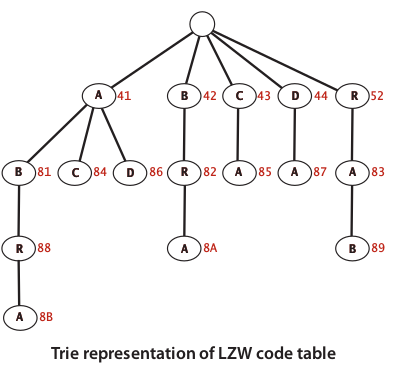

## LZW Compression {#lzw-compression}

LZW try to improve encoding performance by creating table lookup for next prefix of character. A encoding technique is very simple but powerful. Step by step LZW compression explained below:

1. Use standard encoding table to encode each character, for example ASCII.

2. Decide a **stop code** use to indicate delimiter or space. For example 80.

3. Allocate a symbol table \(key - value\) to store prefix encoding.

4. Scan each input character until we found **longest prefix.**

5. If we found new longest prefix, then stored in into symbol table with 8-bit value. For example, prefix AB with code 81.

6. Else we encode each discovered longest prefix with codeword value in the symbol table.

7. Repeat step 4 until all character have been scanned.

An image below illustrate how to compress text \_ABRACADABRA\_using LZW compression

For efficiency, we store table of codewords as a **Trie Symbol Table ** \(**TST**\).



If we know the stop code used for compression, it is easy to decompress the LZW compressed bits. The step-by-step to do decompressing or expand is similar to compressing scheme. But, there is a tricky technique in the case to avoid stuck while constructing symbol table. For example, in the case to decompress text _ABABABA_ with compressed bitstream _41 42 81 83 80_, we need to ensure that codeword 83 is a prefix ABA. The decompressing process of text _ABABABA_ illustrated in an image below.


The implementation of LZW compression over 8-bit extended ASCII alphabet with 12-bit codewords using java will be looked like this:

```
public class LZW {
    private static final int R = 256;
    private static final int L = 4096;
    private static final int W = 12;

    private LZW() {}

    public static void compress() {
        String input = BinaryStdIn.readString();
        TST<Integer> st = new TST<Integer>();
        for (int i = 0; i < R; i++)
            st.put(“” + (char) i, I);
        int code = R+1;

        while (input.length() > 0) {
            String s = st.longestPrefixOf(input);
            BinaryStdOut.write(st.get(s), W);
            int t = s.length();
            if (t < input.length() && code < L)
                st.put(input.substring(0, t + 1), code++);
            input = input.substring(t);
        }
        BinaryStdOut.write(R, W);
        BinaryStdOut.close();
    }

    public static void expand() {
        String[] st = new String[L];
        int i;

        for (i = 0; i < R; i++)
            st[i] = “” + (char) i;
        st[i++] = “”;

        int codeword = BinaryStdIn.readInt(W);
        if (codeword == R) return;
        String val = st[codeword];

        while (true) {
            BinaryStdOut.write(val);
            codeword = BinaryStdIn.readint(W);
            if (codeword == R) break;
            String s = st[codeword];
            if (i == codeword) s = val + val.charAt(0);  // Special case
            if (i < L) st[i++] = val + s.charAt(0);
            val = s;
        }
        BinaryStdOut.close();
    }

    public static void main(String[] args) {
        if         (args[0].equals(“-”)) compress();
        else if     (args[0].equals(“+”)) expand();
        else thr ow new IllegalArgumentException(“Illegal command line”);
    }
}
```


