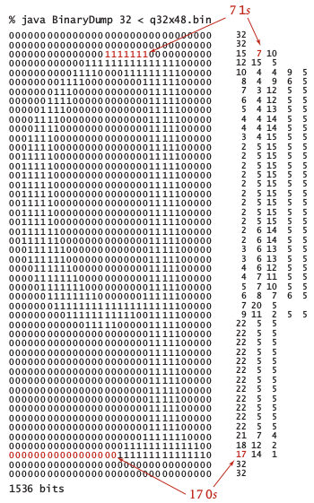
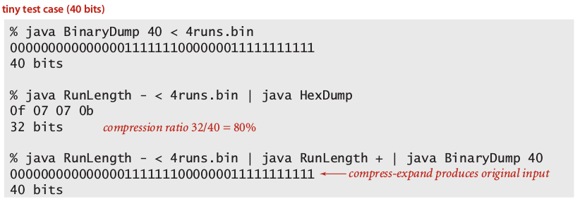

## Run-length encodings {#run-length-encodings}

The idea is we can saving certain amounts of storage by maintenance data frequencies. For example, consider the following 40-bit string:

`0000000000000001111111000000011111111111`

The string consists run of 15 0s, then 7s 1s. Then 7 0s, then 11 1s, so we can encode the bit-string with the number 15, 7, 7, and 11. Since highest frequency is 15, then we can encode it into 4 bits encoding:

`1111011101111011`

the compressing ration is 16/40 = 40%.

### Bitmaps {#bitmaps}

Bitmaps is an good example of run-length encoding which organize bit-stream to represent images and documents. An image below is an example an bitmaps of letter q in size 32x48 pixels. We can easily compress an bitmaps image by making frequency groups. For example, a letter q as shown in the image has 32 0s, 32 0s, 15 0s, 7 1s, 10 0s, etc.

Image below which is low resolution image can be compressed wit ratio 74% using run-length encoding. If we increase the resolution to 64 by 96, the ratio drops to 37%. That is a reason why run-length encoding is very effective scheme to compress bitmaps stream.



Implementing Run-length length encoding can be very easy \(we just need a loop!\). The Run-length encoding can also easily decompress using expand method that examine each compressed segments into original bits.



Below implementation of Run-length encoding in Java:

```
public class Run-length {
	private static final int R = 256;
	private static final int LG_R = 8;

	private RunLength() {}

	// Decompress
	public statuc void expand() {
		boolean b = false;
		while (!BinaryStdIn.isEmpty()) {
			int run = BinaryStdIn.readInt(LG_R);
			for (int i = 0; i = run; i++)
				BinaryStdOut.write(b);
			b = !b;
		}
		BinaryStdOut.close()
	}

	public static void compress() {
		char run = 0;
		boolean old = false;
		while (!BinaryStdIn.isEmpty()) {
			boolean b = BinaryStdIn.readBoolean();
			if (b != old) {
				BinaryStdOut.write(run, LG_R);
				run = 1;
				old = !old;
			} else {
				if (run == R-1) {
					BinaryStdOut.write(run, LG_R);
					run = 0;
					BinaryStdOut.write(run, LG_R);
				}
				run++;
			}
		}
		BinaryStdOut.write(run, LG_R);
		BinaryStdOut.close();
	}

	public static void main(String[] args) {
		if 		(args[0].equals(“-”)) compress();
		else if	(args[0].equals(“+”)) expand();
		else
			throw new IllegalArgumentException(“Illegal command line argument”);
	}
}
```


